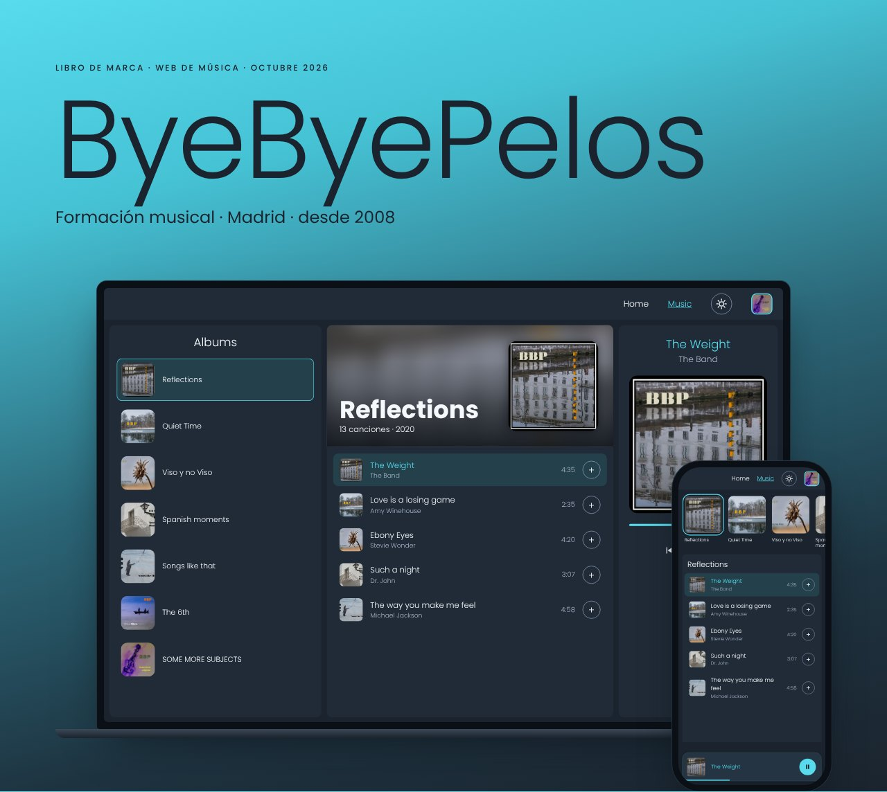
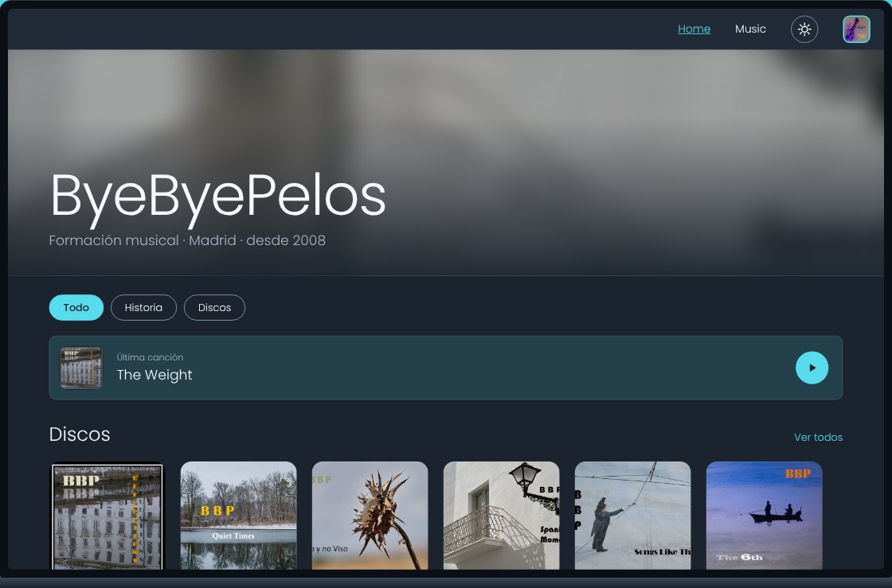
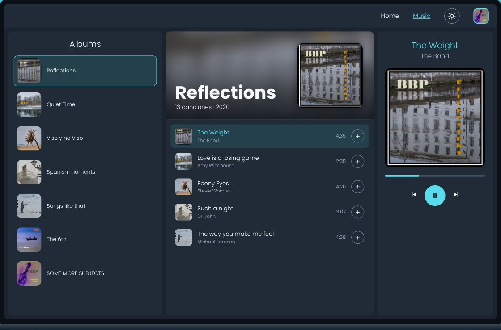
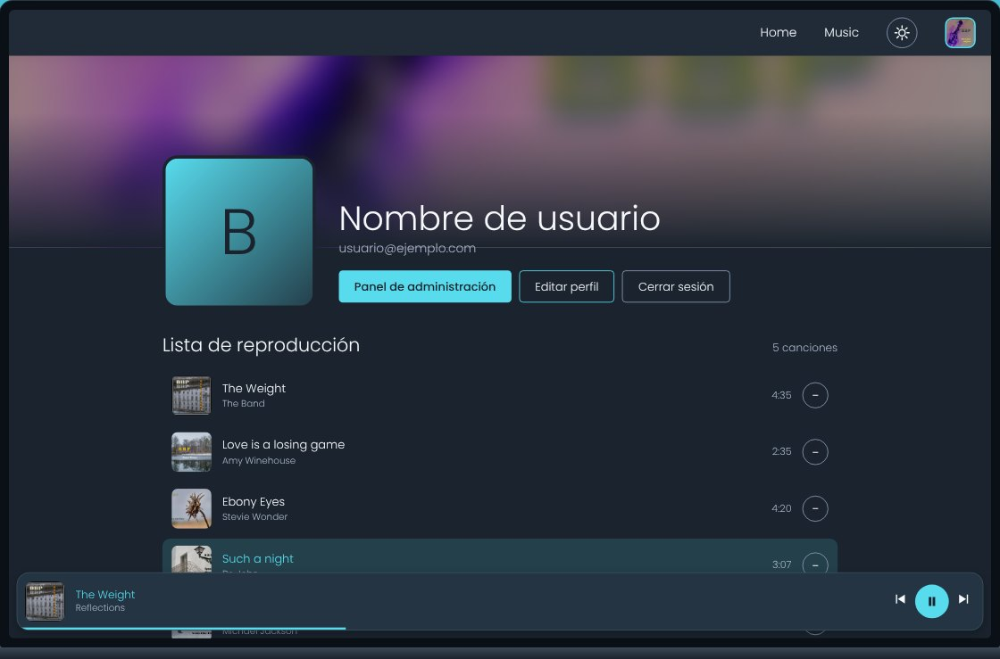
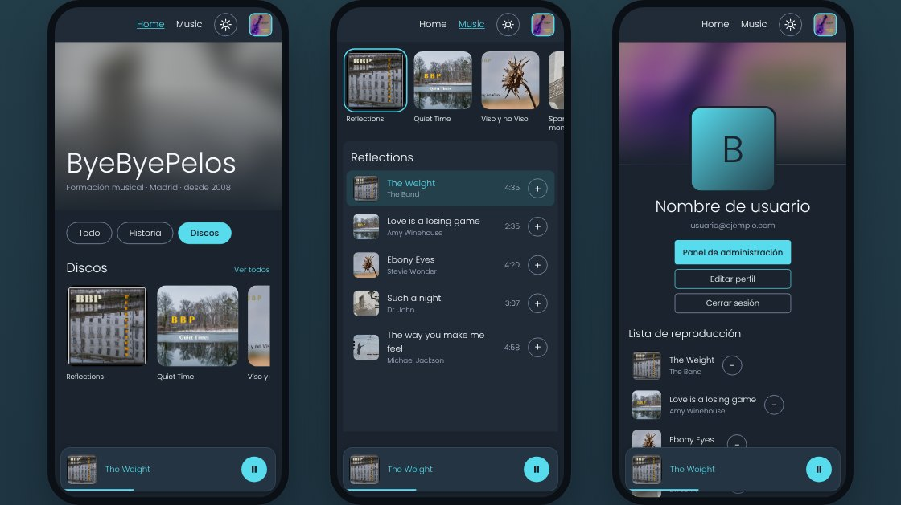
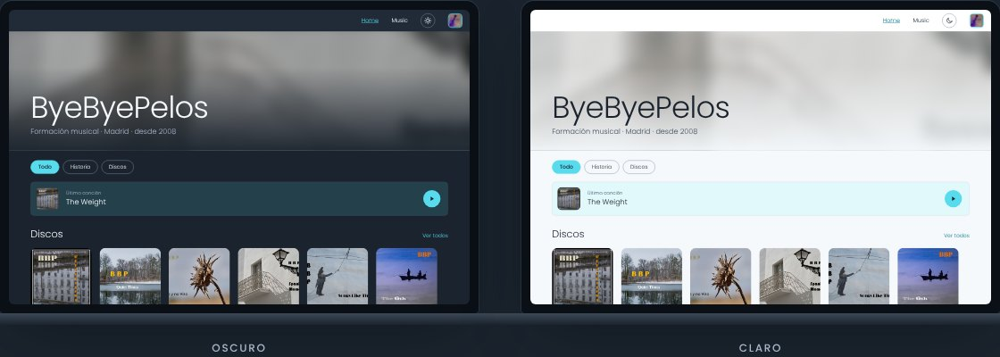

# ByeByePelos · Frontend

Web de música de ByeByePelos: historia de la banda, discos, reproductor y cuentas de usuario.

- Web: https://byebyepelosmusic.vercel.app/
- Backend: [backend-byebyepelos](https://github.com/DavidMachio/backend-byebyepelos)
- Tecnología: React 18 + Vite 5, desplegado en Vercel (Node.js 22.x)

## Cómo se ve

Las pantallas siguen el nuevo diseño: azul noche, blanco hielo, acento cian `#57DBED`, Poppins ligera, portadas cuadradas con esquinas redondeadas y modo claro y oscuro.

### Home

### Music

### Perfil

### Móvil

### Modo oscuro y modo claro

